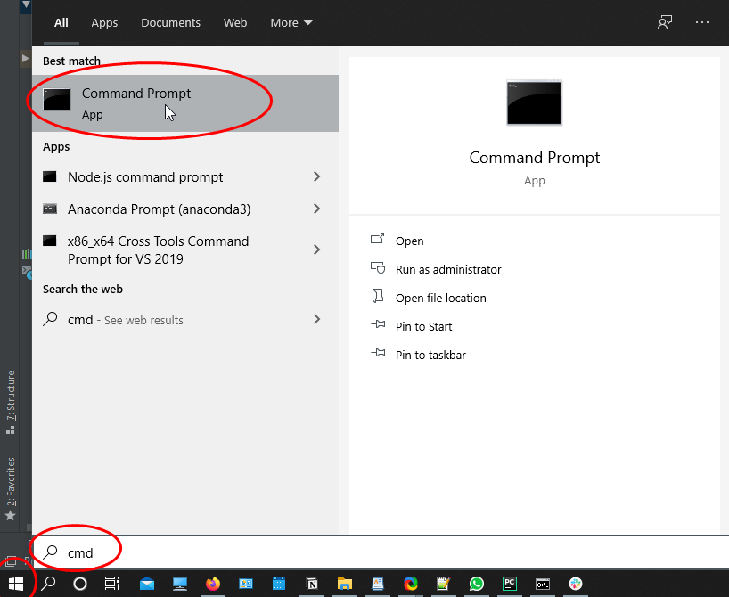
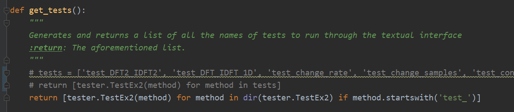

# HUJI Image Processing course (67829) Ex3 Tests 2020/2021<a name="TOP"></a>
[](https://github.com/AssafHalsadi/Tests_ImageProcessingEx02)


Testing suite for the third exercise of Image Processing course (67829) at HUJI. The suite includes basic tests for most of the exercises functions that checks the API, the return values, usage of loops and some functionality. In this README I will go over [requirements](#REQ), a [guide](#HOWTO) of how to use the tests, each tests coverage and what it means to pass it.

## TLDR - If you don't know what to do, start here
The table of contents has links to all of the needed instructions, if you are just interested in running the tests:

Go to [Installation](#SETUP), install the tests, and [run the tests](#HOWTO).

If you are confused about the results, go to the [Understanding your results](#UNDER) section.

If you don't know what a test checks, go to the [Test Scopes](#SCOPES) section.

If you find any issues, or want to ask a question, go to the [Contact Info](#CONTACT) section.


## :warning: DISCLAIMER :warning:
Passing these tests DOES NOT guaranty you will get a good grade in any way, as they are not moderated by the course's staff.
I will try and make it as clear as possible as to which extent the tests cover the exercise, but i felt the disclaimer was needed in any case.

**Generally** _(Will be expanded in "Test Scopes" section)_
1. Tests for Pyramid Building related functions check the size is correct for the general pyramid and each level separately and that the value range does not change when creating a gaussian pyramid.
2. The est for recreating the image from laplacian checks that the recreated image is close to the original, working with a cv2 built in implementation (kind of) of a laplacian pyramid. Uses correlation I chose, might induce false positives.
3. Tests the rendering module creates a proper image.
Tests for "blending" were not implemented, as we are required to actually blend images, and if an issue rises, we will see it.

All tests cover basic API checks, correct usage of return/loops and some specific functionality that is explained in the [code doc](#DOC).

## Table Of Contents
* General Info
    * [Documentation](#DOC)
    * [Collaborators](#COL)
    * [Contact Info](#CONTACT)
* How to use
    * [Installation](#SETUP)
    * [Running Through Command Line](#CMD) (Textual Interface)
    * [Running Through Pycharm](#PY)
* Understanding your results
    * [Trough Command Line](#CMD2) (Textual Interface)
    * [Through Pycharm](#PY2)
* Test Scopes
    * Pyramid Building
        * ['test_build_gaussian_pyramid_static'](#GAUSTAT)
        * ['test_build_gaussian_pyramid_random'](#GAURAND)
        * ['test_build_laplacian_pyramid_static'](#LAPSTAT)
        * ['test_build_laplacian_pyramid_random'](#LAPRAND)
    * Recreating Image
        * ['test_laplacian_to_image'](#LAPTOIM)
    * Rendering Pyramids
        * ['test_render_pyramid_static'](#RENDERSTAT)
        * ['test_render_pyramid_random'](#RENDERRAND)

    
## :books: Documentation<a name="DOC"></a>
[](https://assafhalsadi.github.io/Tests_ImageProcessingEx03/#/ )

:arrow_up: _Easy navigation through this README file can be found here_ :arrow_up:
_images might not work there_

## Collaborators<a name="COL"></a>
[Assaf Halsadi](https://github.com/AssafHalsadi) :israel:

<!-- [Ron Moran](https://github.com/ronmoran) :israel:  -->

## Contact Info<a name="CONTACT"></a>
:heavy_exclamation_mark: please do not send me private messages about the tests through whatsapp

If you find any mistakes, or have any questions - please contact me through the course's Slack [](https://join.slack.com/t/huji-impr-20/shared_invite/zt-i5z2lgja-vs8c6RptH8t2_jou~Wvhuw)

Or at the courses forum at the relevant post [](https://moodle2.cs.huji.ac.il/nu20/course/view.php?id=67829)

You may also send me an email at : [](assaf.halsadi@mail.huji.ac.il)

## Requirements<a name="REQ"></a>
To run the tests you will only need the following things:

[](https://www.python.org/downloads/)
[](https://github.com/AssafHalsadi/Tests_ImageProcessingEx02)
[](https://moodle2.cs.huji.ac.il/nu20/course/view.php?id=67829)

## How to - running the tests<a name="HOWTO"></a>
### Setup<a name="SETUP"></a> 
1. Clone this repository into a _"tests"_ folder within your project's root folder:
    * Open a new folder named _"tests"_ in your project's root folder.
    * Open a command line on your computer, I will use cmd as an example on windows:
    <details>
    <summary>Open Image</summary>
    <p></p>
    </details>
    
    * Go to the _tests_ folder using the `cd` command like so : `_cd [path_to_project]/tests` (change [path_to_project] with the path to your project):
     <details>
    <summary>Open Image</summary>
    <p></p>
    </details>
    
    * Go to the [top of the page](#TOP), there you should copy the git link: 
    <details>
    <summary>Open Image</summary>
    <p></p>
    </details>
    
    * Type `git clone *copy here*` :
    <details>
    <summary>Open Image</summary>
    <p></p>
    </details>
    
    * You might be prompted to enter your [CSE user credentials](https://wiki.cs.huji.ac.il/wiki/Password_and_OTP#OTP_and_UNIX_passwords)

 
2. Copy _sol3.py_ and any other files needed for your implementation to the _tests_ folder.
3. At the end your "tests" folder should look like this:
    <details>
    <summary>Open Image</summary>
    <p></p>
    </details> 
   
4. That is it, no need for complicated voodoo. :smile:

### Usage 
There are two main ways to run the tests, via the Textual Interface or via pycharm's built in unittest support.
I'll go through both of these here.
#### Textual Interface<a name="CMD"></a>
1. Go to the project's folder.
2. Go to the _tests_ sub-folder.
3. Double click on _'RunMe.bat'_:
    <details>
    <summary>Open Image</summary>
    <p></p>
    </details>
 
If everything went according to plan, A cmd window should open, and after a while the tests will start running.

**Remark**: Some of the tests take A LOT of time to complete. To run only SOME of the tests open the _runner.py_ and scroll down to this function:

Flip which lines are commented like so:

and delete the names of the tests you don't want to run.
#### Pycharm<a name="PY"></a>
1. Go to _test _ sol3.py_ file, located in the "tests" folder.
2. To run all of the tests, scroll down to the TestSuite start and click the green "play" button :
    <details>
    <summary>Open Image</summary>
    <p></p>
    </details>
    
    or right click anywhere in the page and click "Run .....":
    <details>
    <summary>Open Image</summary>
    <p></p>
    </details>

3. To run an individual test, scroll down to the test's function and click on the green "play" button beside it :
    <details>
    <summary>Open Image</summary>
    <p></p>
    </details>
You can identify tests by the face they all start with `def test_...`

## Understanding your results<a name="UNDER"></a>
### Through Command Line<a name="CMD2"></a>
Once you open _RunMe.bat_ a command line window will open, and after a short while the tests will start running.
There are 9 tests that cover general test cases for all of the exercise's API (some tests test multiple functions).
 
The testing process will look like this:
<details>
<summary>Open Image</summary>
<p>

* The RED part indicates how many tests are left.
* The GREEN part will only show if that particular test have finished running and either be "ok" if the test passed or "FAILED" otherwise.
* The last test in the list will be the one that is currently running, and will look like the ORANGE part in the image.
* The text in the PURPLE part will be the NAMES of the tests and their location in the code.

</p>
</details>

When the tester ends, if you passed all test you will see the word "OK" in capital letters at the bottom of the window, like so:
    <details>
    <summary>Open Image</summary>
    <p></p>
    </details>

Otherwise, you will see "Failure" at the bottom, and the number of failed tests:
    <details>
    <summary>Open Image</summary>
    <p></p>
    </details>

and which tests failed at the top:
    <details>
    <summary>Open Image</summary>
    <p></p>
    </details>
    
The errors will be separated by a line of "===", and look like the following picture:
    <details>
    <summary>Open Image</summary>
    <p></p>
    </details>
    
### Through Pycharm<a name="PY2"></a>
Once you run a test, a console will open at the bottom of the pycharm screen, make sure both of the following symbols are pressed to be able to see all tests, both passed tests and failed ones:
    <details>
    <summary>Open Image</summary>
    <p></p>
    </details>
    
If you passed all of the tests, all branches at the bottom left of the screen will have a small green :heavy_check_mark: and a red "OK" will be written at the bottom of the console:
    <details>
    <summary>Open Image</summary>
    <p></p>
    </details>
    
If you haven't, some tests will have a small orange X mark beside them:
    <details>
    <summary>Open Image</summary>
    <p></p>
    </details>
    
Each error explanation will begin with the word "Failure", followed by the traceback of the issue:
    <details>
    <summary>Open Image</summary>
    <p></p>
    </details>

## Test Scopes<a name="SCOPES"></a>
### Pyramid Building
All Pyramid Building tests check the structure of your pyramids.
#### 'test_build_gaussian_pyramid_static' <a name="GAUSTAT"></a>
```python
"""
Runs a static test on "build_gaussian_pyramid".
:return: -
"""
```
This test tests both the structure of the build_gaussian_pyramid's output:
* Checks the value range does not change.
* Checks the signature is correct.
* Makes sure the shape and type of the output is correct - including on each pyramid level.
* Checks the filter was created correctly.  
* Checks on both stock memes (images) and taylor made matrices.

#### 'test_build_gaussian_pyramid_random'<a name="GAURAND"></a>
```python
"""
Runs a random test on "build_gaussian_pyramid".
:return: -
"""
```
Random variant of the previous test (stress testing).

#### 'test_build_laplacian_pyramid_static' <a name="LAPSTAT"></a>
```python
"""
Runs a static test on "build_laplacian_pyramid".
:return: -
"""
```
This test tests both the structure of the build_laplacian_pyramid's output:
* Checks the signature is correct.
* Makes sure the shape and type of the output is correct - including on each pyramid level.
* Checks the filter was created correctly.  
* Checks on both stock memes (images) and taylor made matrices.

#### 'test_build_laplacian_pyramid_random'<a name="LAPRAND"></a>
```python
"""
Runs a random test on "build_laplacian_pyramid".
:return: -
"""
```
Random variant of the previous test (stress testing).

### Recreating Images
#### 'test_laplacian_to_image'<a name="LAPTOIM"></a>
```python
"""
Tests laplacian_to_image. I test it on a built in implementation laplacian pyramid so that it isn't dependant
on the user's implementation of other functions.
:return: -
"""
```
Compares the reconstructed image to the real one by using pearsons R coefficient and MSE by using the implementation on a semi-builtIn cv2 implementation  

### Rendering Pyramids
#### 'test_render_pyramid_static'<a name="RENDERSTAT"></a>
```python
"""
Tests the render_pyramid with static variables on all stock images.
:return: -
"""
```
This test tests the "render_pyramid" function applied to multiple images, it covers:
* Checks the signature is correct.
* Makes sure the dimensions are correct.
* Makes sure it was padded with zeros.

#### 'test_render_pyramid_random'<a name="RENDERRAND"></a>
```python
"""
Tests 'render_pyramid' with random level variables on ALL stock images.
:return: -
"""
```
Random variant of the previous test (stress testing).


